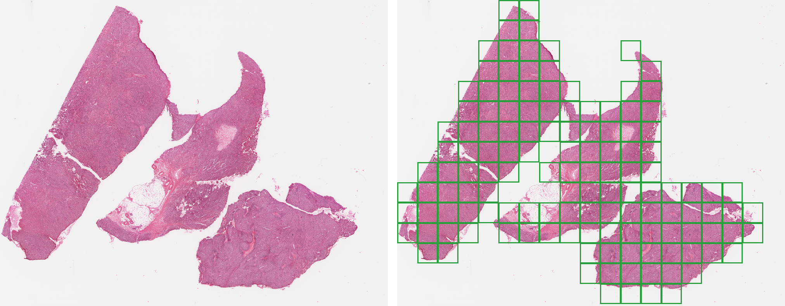

# Slideforge




[](https://crates.io/crates/slideforge)

[](https://docs.rs/slideforge)

[](https://www.gnu.org/licenses/gpl-3.0)

[](https://www.rust-lang.org)

---

Slideforge is a lightweight, open-source library for tile extraction on Whole Slide Images (WSI) written in Rust. It utilizes features inherent to Rust, such as memory safety and concurrency, to provide fast and efficient tile extraction. Additionally, it implements basic slide preprocessing techniques, such as tissue detection and color normalization, to enhance the quality of extracted tiles. Slideforge aims to be easily integrable into existing projects, pipelines, and workflows, and is available on Linux, macOS, and Windows.

## Features

- Aperio SVS pyramid parsing and tile extraction
- Resolution-targeted extraction: Users can pick either an exact pyramid level or a target Microns-Per-Pixel (MPP) value
- Otsu thresholding for tissue detection and filtering
- Reinhard stain normalization
- Sequential or parallel tile processing via [rayon](https://crates.io/crates/rayon)
- Tile output in JPEG format or serialized as a TensorFlow TFRecord file
- PDF extraction reports, for a single slide or an entire dataset
- Batch processing over a whole directory of slides
- Cross-platform support for Linux, macOS, and Windows

## Planned

- Additional tissue filtering and stain normalization methods beyond Otsu thresholding and Reinhard normalization
- Unit test coverage for `cli.rs`, `report.rs`, `tfrecord.rs`, `logging/`, and `decoder/`
- Python integration for downstream ML pipelines (e.g. a thin CLI wrapper), evaluated on an experimental branch of [AutoMIL](https://github.com/frankkramer-lab/AutoMIL)

## Getting Started

This section provides an overview of how to get started with Slideforge, using either its Command Line Interface (CLI) or the Rust library.

### Installation

Slideforge is [published on crates.io](https://crates.io/crates/slideforge). To get the CLI:

    cargo install slideforge

As a library, add it to your `Cargo.toml`:

    [dependencies]
    slideforge = "0.1"

Alternatively, download a prebuilt CLI binary from the
[Releases page](https://github.com/WaibelJonas/slideforge/releases) — Windows, macOS (Intel + Apple Silicon), and Linux builds are published with every release. Building from the git repository directly (`cargo install --git https://github.com/WaibelJonas/slideforge`) also works, if you want the latest unreleased commit.

Slideforge requires **Rust 1.85 or later**.

### CLI

    slideforge extract slide.svs \
      --target-mpp 0.5 \
      --min-tissue-fraction 0.1 \
      --stain-normalize \
      --tile-dir tiles/ \
      --report report.pdf

The above example extracts tiles from `slide.svs`, resampled to 0.5 microns-per-pixel, drops tiles that are
mostly background, applies Reinhard stain normalization, saves loose `.jpg`
tiles to `tiles/`, and writes a PDF extraction report. A `.tfrecord` is
always written alongside (default: `<slide-stem>.tfrecord`, override with
`--tfrecord-file`).

    slideforge dataset ./slides ./output --target-mpp 0.5 --min-tissue-fraction 0.1 --report dataset_report.pdf

The above example extracts tiles from all slides in `./slides`, in the same manner as the single-slide example, and writes a PDF report for the entire dataset. As with `extract`, a `.tfrecord` is always written per slide, under `./output/<slide-stem>/<slide-stem>.tfrecord`, loose `.jpg` tiles are opt-in via `--tiles`.

### Library

```rust
use slideforge::slide::{Slide, SlideOutputs};
use slideforge::ExtractionOptions;

fn main() -> Result<(), Box<dyn std::error::Error>> {
    let slide = Slide::open("slide.svs")?;

    let options = ExtractionOptions::parallel()
        .with_target_mpp(0.5)
        .with_min_tissue_fraction(0.1)
        .with_stain_normalization();

    // Governs output channels
    let outputs = SlideOutputs::default().with_tile_dir("tiles/");

    // Closure defines additional behaviour
    slide.extract(&options, &outputs, |tile| {
        println!("kept tile ({}, {})", tile.tile_x(), tile.tile_y());
        Ok(())
    })?;

    Ok(())
}
```

## Documentation

Full API documentation is on [docs.rs/slideforge](https://docs.rs/slideforge). To generate it locally instead:

    cargo doc --open --no-deps

## Resources

For more information on general concepts and techniques used in slideforge, please refer to the following resources:

- [Whole Slide Imaging (WSI)](https://en.wikipedia.org/wiki/Whole_slide_imaging)
- [Otsu's Method](https://en.wikipedia.org/wiki/Otsu%27s_method)
- [Reinhard Stain Normalization](https://ieeexplore.ieee.org/document/946629)

For more information on the Aperio SVS file format, please refer to the following resources:

- [Aperio SVS File Format](https://openslide.org/formats/aperio-svs/)
- [OpenSlide](https://openslide.org/)

The reference tile that serves as a target for stain normalization is taken from the WSI `TCGA-B9EB312E82F6` from [The Cancer Genome Atlas (TCGA)](https://www.cancer.gov/about-nci/organization/ccg/research/structural-genomics/tcga)

## License

Slideforge is licensed under the [GNU General Public License v3.0](https://www.gnu.org/licenses/gpl-3.0). see [LICENSE](LICENSE) for the full text.

See [CHANGELOG.md](CHANGELOG.md) for release history.
